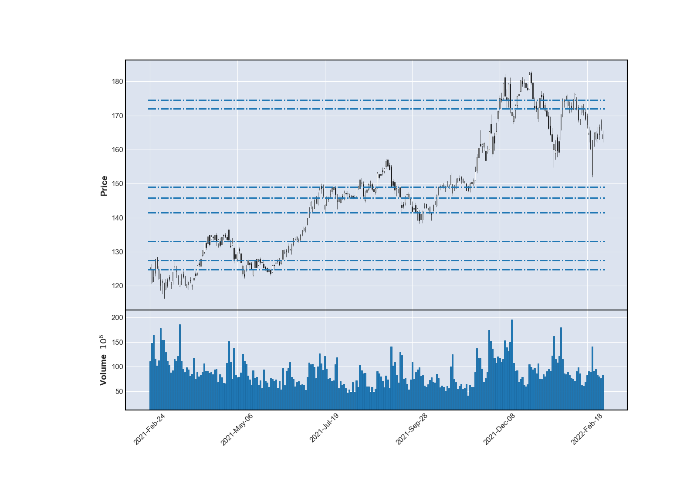

# Support and Resistance Indicator

This function takes in a dateframe of a security with tradebar data and returns a list and a dictionary with values indicating support and resistance. The dictionary returns the price as the key and the strength, or number of times the level was tested, as the value.

  <kbd>
    
  </kbd>

## Description

In the stock market stock prices will tend to move towards key levels. These levels are support and resistance. They are areas that generally have some form of significant price movement. Depending on the time frame, the levels you find may result in stronger more volatile moves. This function can be used on any time frame and has noise reduction capabilities.

### Features

- Use on any time frame
- Noise reduction
- Parameters allow for security customization

### Built with

- Python

### Usage

GIFs are useful here to see the project in action.

### Troubleshooting

Most issues with this function would be with formatting of your dataframe. Make sure that your dataframe has open, close, high, and low column. Make sure that they are all lower case. A volume column is fine as well, but is not used in calculation.

## Photos

Some more photos of the project and the build process.

### Legal disclaimer

Usage of this tool in financial systems, trading algorithms or other programs is done at your own risk. 

### License

This project is licensed under the [MIT License](LICENSE.md).

## Acknowledgments

Inspiration, code snippets, etc.
* [Adapted from TINY README](https://gist.github.com/noperator/4eba8fae61a23dc6cb1fa8fbb9122d45)

